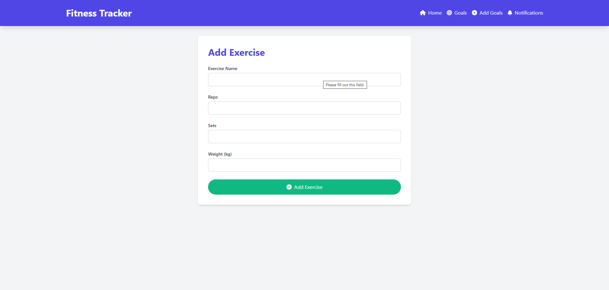

<h1 align="center">🏋️‍♂️ Fitness Tracker Pro</h1>

<h4 align="center">A comprehensive fitness tracking web application built with <a href="https://flask.palletsprojects.com/" target="_blank">Flask</a>, <a href="https://www.mongodb.com/" target="_blank">MongoDB</a>, and <a href="https://tailwindcss.com/" target="_blank">Tailwind CSS</a>.</h4>

  <a href="#about">About</a> •
  <a href="#key-features">Key Features</a> •
  <a href="#technologies-used">Technologies Used</a> •
  <a href="#functionality">Functionality</a> •
  <a href="#user-interface">User Interface</a> •
  <a href="#acknowledgments">Acknowledgments</a>

  

## About

Fitness Tracker Pro is a powerful web application designed to help users monitor and improve their fitness journey. With an intuitive interface and comprehensive features, it allows users to track exercises, set fitness goals, and receive timely reminders to stay on track.

## Key Features

<ul>
  <li>📊 Exercise Logging: Easily record and manage your workout sessions</li>
  <li>🎯 Goal Setting: Set and track both cardio and strength training goals</li>
  <li>🔔 Smart Reminders: Receive notifications to stay consistent with your fitness routine</li>
  <li>📱 Responsive Design: Seamless experience across desktop and mobile devices</li>
  <li>🔒 Secure Data Storage: Your fitness data is safely stored and easily accessible</li>
</ul>

## Technologies Used

  
  
  
  
  

## Functionality

  

    <h3>Exercise Management</h3>
    <ul>
      <li>Add, edit, and delete exercises</li>
      <li>Record exercise details including name, reps, sets, and weight</li>
      <li>View exercise history in a clean, tabular format</li>
    </ul>
    
  

  

    <h3>Goal Setting</h3>
    <ul>
      <li>Set comprehensive fitness goals for both cardio and strength training</li>
      <li>Track progress towards goals with visual indicators</li>
      <li>Receive notifications for goal achievements and reminders</li>
    </ul>
    
  

## User Interface

The Fitness Tracker Pro boasts a clean, intuitive user interface designed with Tailwind CSS. Key UI components include:

  

    <h4>Dashboard & Exercise Logging</h4>
    
    
Comprehensive dashboard showing exercise logs and quick stats

  

  

    <h4>Goals Management</h4>
    
    
Set and track your fitness goals with detailed metrics

  

  

    <h4>Quick Goal Setting</h4>
    
    
Streamlined interface for setting basic fitness goals

  

## Acknowledgments

Special thanks to the open-source community and the creators of the technologies that made this project possible. We're particularly grateful to:

<ul>
  <li>The Flask team for their excellent web framework</li>
  <li>MongoDB for providing a robust and flexible database solution</li>
  <li>The Tailwind CSS team for their utility-first CSS framework</li>
</ul>

  Made with ❤️ by Deep Sojitra

